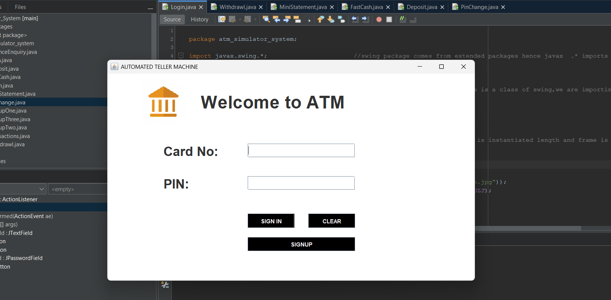
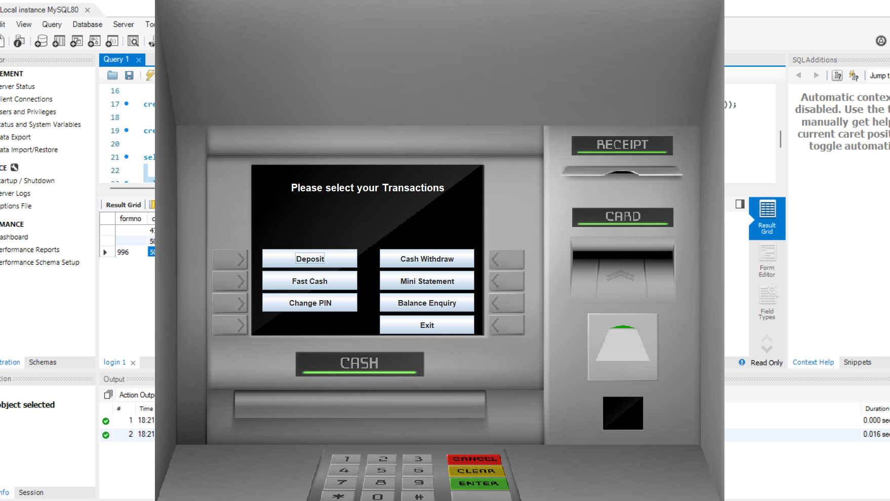
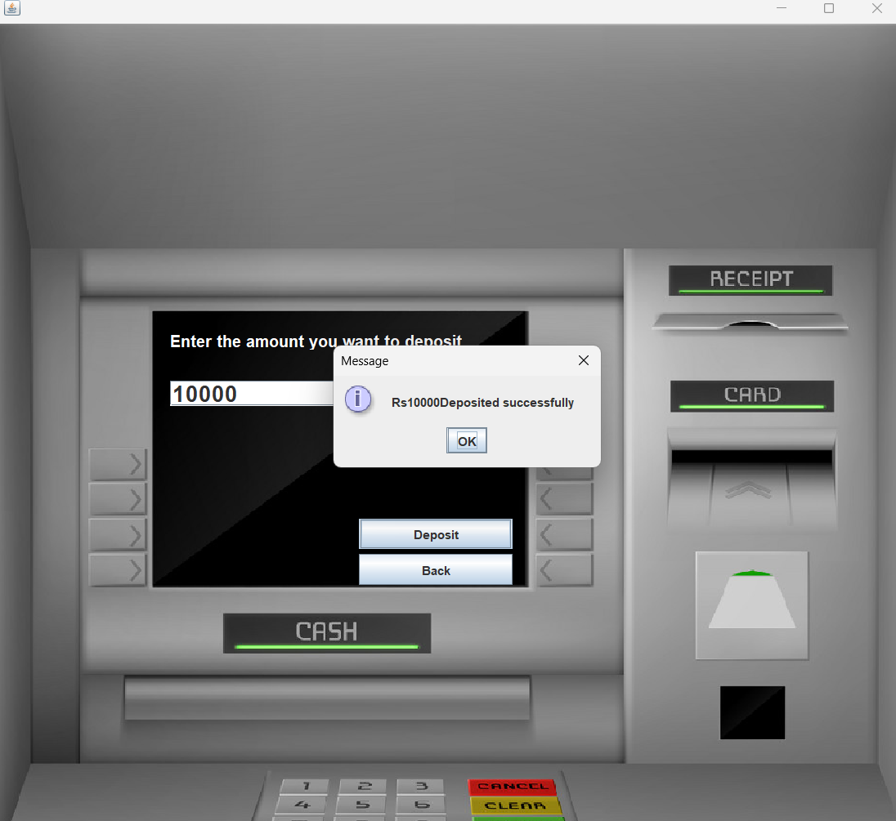
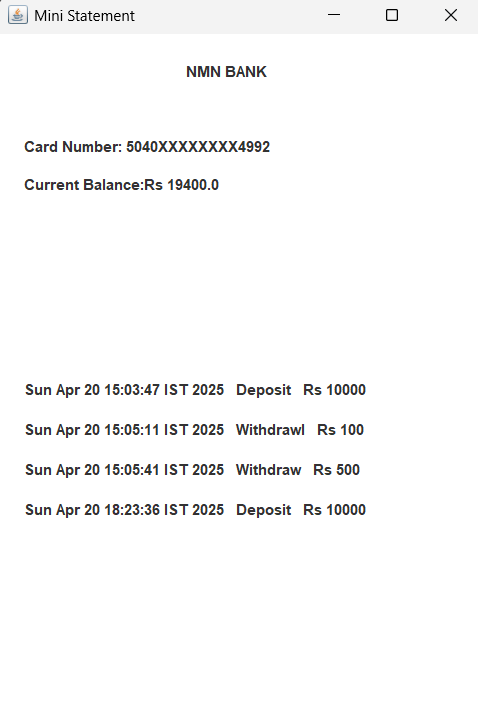

# 💳 ATM Management System

A Java-based GUI application that simulates the core functionalities of an Automated Teller Machine (ATM). Built using Java Swing for the user interface and MySQL for database management.

## 🛠️ Features

- **User Authentication**: Login with PIN verification.
- **Transaction Services**:
  - Balance Inquiry
  - Cash Withdrawal
  - Cash Deposit
  - Mini Statement (Transaction History)
  - PIN Change
- **Secure Session Handling**
- **Responsive GUI**: Intuitive and user-friendly interface using Java Swing.
- **MySQL Integration**: Persistent data storage for users, transactions, and login sessions.

## 📸 Screenshots

Here are a few screenshots showcasing the project interface and functionalities.
> _Interface Preview_

### 🖥️ Login Page


### 💳 Menu


### 💰 Deposit Page


### 📄 Mini Statement



## 🔧 Technologies Used

- **Java**
- **Java Swing**
- **MySQL**
- **JDBC (Java Database Connectivity)**
- **NetBeans / IntelliJ (IDE of your choice)**

## 🧩 Project Structure

```
atm_simulator_system/
│
├── Conn.java               # Handles database connection
├── Login.java              # User login screen
├── Transactions.java       # Dashboard for transaction options
├── Deposit.java            # Deposit screen
├── Withdrawl.java          # Withdrawal screen
├── MiniStatement.java      # Shows recent transactions and balance
├── PinChange.java          # Change user's PIN
├── FastCash.java           # Quick withdrawal with predefined amounts
├── SignupOne.java          # Signup Step 1
├── SignupTwo.java          # Signup Step 2
├── SignupThree.java        # Signup Step 3
├── icons/                  # ATM background and icon images
└── README.md               # This file
```

## 💾 Database Schema

**Tables Used:**

- `login`: Stores user login credentials (PIN, card number)
- `signupthree`: Contains final user details including PIN
- `bank`: Stores transactions (`date`, `type`, `amount`, `pin`)
- `signupone`, `signuptwo`: Multi-step form data for signup

## 🔐 Security Notes

- PIN numbers are stored and verified for authentication.
- Basic validation on PIN change and inputs.
- Prepared statements can be added for more secure SQL operations.

## 🚀 Getting Started

### Prerequisites

- Java 17 or higher
- MySQL Server
- IDE like NetBeans, IntelliJ, or Eclipse

### Setup Instructions

1. Clone the repository.
2. Create the MySQL database and import the provided schema.
3. Update your MySQL credentials in `Conn.java`.
4. Run the project via your IDE.

## 📦 Future Improvements

- Encrypt user PINs using hashing algorithms.
- Add real-time ATM withdrawal limits.
- Responsive layout using JavaFX.
- Role-based access (admin panel).

## 🙋‍♂️ Author

- **NAMAN RAI**
- [GitHub](https://github.com/NamanRaii24)
- Email: namanr073@gmail.com

---
